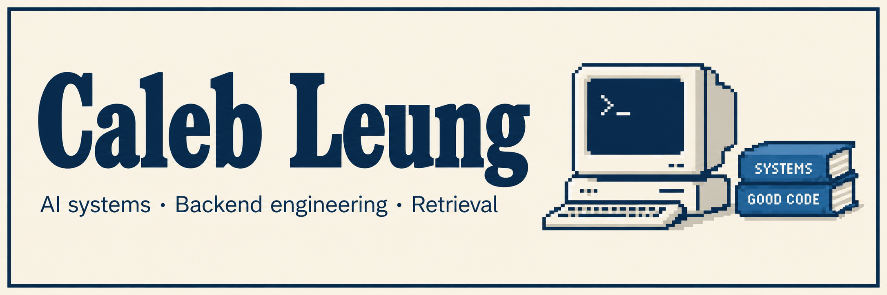

Software engineer in Brooklyn, building production AI systems at IntellPro.

## Selected work

### IntellPro

Document ingestion, OCR and RAG pipelines processing around 3,000 documents a day.

### Anime MCP

Building an MCP server for anime-character search. Currently researching hybrid ranking and score calibration before implementing embeddings.

## Currently investigating

How should lexical and semantic scores be combined when their score distributions differ?

### Research notes

I'm currently studying the foundations of hybrid fusion, focusing on score normalization and how different score distributions affect ranking. Next, I plan to investigate relevance-probability calibration.

Papers guiding my reading:

- [An Analysis of Fusion Functions for Hybrid Retrieval](https://arxiv.org/abs/2210.11934)
- [Score distribution models: assumptions, intuition, and robustness to score manipulation](https://dl.acm.org/doi/10.1145/1835449.1835491)
- [Classifier Calibration: A survey on how to assess and improve predicted class probabilities](https://arxiv.org/abs/2112.10327)
- [Query Performance Prediction for Neural IR: Are We There Yet?](https://arxiv.org/abs/2302.09947)

## Tools I use

Python · Elixir · TypeScript 
FastAPI · Pydantic · Oban Pro 
PostgreSQL · Vector Database · AWS (ECS, S3, SQS) · Docker · GitHub Actions · Et cetera

---

[LinkedIn](https://www.linkedin.com/in/caleb-kwan-ho-leung-a67b74168/) · [Email](mailto:caleb.leungkwanho@gmail.com)
