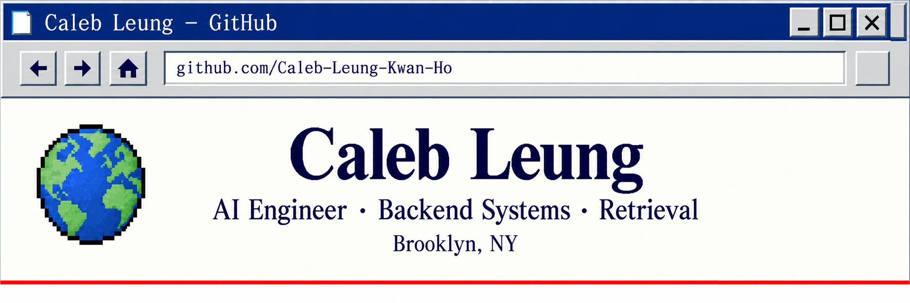

🇬🇧 English

  <a href="#about">ABOUT</a>&nbsp;&nbsp;|&nbsp;&nbsp;
  <a href="#selected-work">WORK</a>&nbsp;&nbsp;|&nbsp;&nbsp;
  <a href="#currently-investigating">NOTES</a>&nbsp;&nbsp;|&nbsp;&nbsp;
  <a href="#contact">CONTACT</a>

---

## About

Software engineer in Brooklyn building production AI systems at IntellPro.

I work on document processing, retrieval, and embedding pipelines, with an emphasis on reliable backend systems and measurable retrieval quality.

---

## Selected work

| Project | Work |
| --- | --- |
| **IntellPro** | AI infrastructure for document ingestion, OCR, chunking, metadata extraction, and embedding orchestration, processing around 3,000 documents per day. |
| **Anime MCP** | Building an MCP server for anime-character search. Currently developing its evaluation and lexical-retrieval foundation while studying hybrid fusion and relevance calibration before implementing embeddings. |

---

## Currently investigating

> **How should lexical and semantic scores be combined when their score distributions differ?**

I'm studying the foundations of hybrid fusion, focusing on score normalization and how different score distributions affect ranking. Next, I plan to investigate relevance-probability calibration and query-adaptive fusion.

### Papers guiding this work

- <a href="https://arxiv.org/abs/2210.11934" target="_blank" rel="noopener noreferrer" aria-label="Open An Analysis of Fusion Functions for Hybrid Retrieval in a new tab">An Analysis of Fusion Functions for Hybrid Retrieval</a>
- <a href="https://dl.acm.org/doi/10.1145/1835449.1835491" target="_blank" rel="noopener noreferrer" aria-label="Open Score distribution models: assumptions, intuition, and robustness to score manipulation in a new tab">Score distribution models: assumptions, intuition, and robustness to score manipulation</a>
- <a href="https://arxiv.org/abs/2112.10327" target="_blank" rel="noopener noreferrer" aria-label="Open Classifier Calibration: A survey on how to assess and improve predicted class probabilities in a new tab">Classifier Calibration: A survey on how to assess and improve predicted class probabilities</a>
- <a href="https://arxiv.org/abs/2302.09947" target="_blank" rel="noopener noreferrer" aria-label="Open Query Performance Prediction for Neural IR: Are We There Yet? in a new tab">Query Performance Prediction for Neural IR: Are We There Yet?</a>

---

## Selected tools & technologies

| Area | Technologies |
| --- | --- |
| **Languages** | Python · Elixir · TypeScript |
| **Backend & orchestration** | FastAPI · Pydantic · SQLAlchemy · Phoenix · Oban Pro |
| **Data & search** | PostgreSQL · Elasticsearch · OpenSearch |
| **Infrastructure** | AWS (ECS, S3, SQS) · Docker · GitHub Actions |
| **Python tooling** | asyncio · pytest |

<a href="https://caleb-leung-kwan-ho.github.io/github-website/#skills" target="_blank" rel="noopener noreferrer" aria-label="Open Full skills &amp; technologies → in a new tab">Full skills &amp; technologies →</a>

---

## Contact

<a href="https://www.linkedin.com/in/caleb-kwan-ho-leung-a67b74168/" target="_blank" rel="noopener noreferrer" aria-label="Open LinkedIn in a new tab">LinkedIn</a> · <a href="mailto:caleb.leungkwanho@gmail.com" target="_blank" rel="noopener noreferrer" aria-label="Open Email in a new tab">Email</a>

Last updated: September 2026

---

🇭🇰 繁體中文（香港）

  <a href="#zh-about">簡介</a>&nbsp;&nbsp;|&nbsp;&nbsp;
  <a href="#zh-work">項目</a>&nbsp;&nbsp;|&nbsp;&nbsp;
  <a href="#zh-research">研究筆記</a>&nbsp;&nbsp;|&nbsp;&nbsp;
  <a href="#zh-contact">聯絡</a>

---

## 簡介

身處 Brooklyn 的 Software engineer，現於 IntellPro 建構 production AI systems。

我從事 document processing、retrieval 和 embedding pipelines，著重可靠的 backend systems 及可量度的 retrieval quality。

---

## 精選項目

| 項目 | 工作內容 |
| --- | --- |
| **IntellPro** | 為 document ingestion、OCR、chunking、metadata extraction 和 embedding orchestration 建構 AI infrastructure，每日處理約 3,000 份文件。 |
| **Anime MCP** | 正在為 anime-character search 建構 MCP server。現正開發其 evaluation 和 lexical-retrieval foundation，並在實作 embeddings 前研究 hybrid fusion 和 relevance calibration。 |

---

## 目前研究中

> **當 lexical 和 semantic scores 的 score distributions 不同時，應如何結合？**

我正在研究 hybrid fusion 的基礎，著重 score normalization 和不同 score distributions 對 ranking 的影響。下一步會研究 relevance-probability calibration 和 query-adaptive fusion。

### 參考論文

- <a href="https://arxiv.org/abs/2210.11934" target="_blank" rel="noopener noreferrer" aria-label="Open An Analysis of Fusion Functions for Hybrid Retrieval in a new tab">An Analysis of Fusion Functions for Hybrid Retrieval</a>
- <a href="https://dl.acm.org/doi/10.1145/1835449.1835491" target="_blank" rel="noopener noreferrer" aria-label="Open Score distribution models: assumptions, intuition, and robustness to score manipulation in a new tab">Score distribution models: assumptions, intuition, and robustness to score manipulation</a>
- <a href="https://arxiv.org/abs/2112.10327" target="_blank" rel="noopener noreferrer" aria-label="Open Classifier Calibration: A survey on how to assess and improve predicted class probabilities in a new tab">Classifier Calibration: A survey on how to assess and improve predicted class probabilities</a>
- <a href="https://arxiv.org/abs/2302.09947" target="_blank" rel="noopener noreferrer" aria-label="Open Query Performance Prediction for Neural IR: Are We There Yet? in a new tab">Query Performance Prediction for Neural IR: Are We There Yet?</a>

---

## 主要工具與技術

| 領域 | 技術 |
| --- | --- |
| **Languages** | Python · Elixir · TypeScript |
| **Backend & orchestration** | FastAPI · Pydantic · SQLAlchemy · Phoenix · Oban Pro |
| **Data & search** | PostgreSQL · Elasticsearch · OpenSearch |
| **Infrastructure** | AWS (ECS, S3, SQS) · Docker · GitHub Actions |
| **Python tooling** | asyncio · pytest |

<a href="https://caleb-leung-kwan-ho.github.io/github-website/#skills" target="_blank" rel="noopener noreferrer" aria-label="Open 完整技能及技術 → in a new tab">完整技能及技術 →</a>

---

## 聯絡

<a href="https://www.linkedin.com/in/caleb-kwan-ho-leung-a67b74168/" target="_blank" rel="noopener noreferrer" aria-label="Open LinkedIn in a new tab">LinkedIn</a> · <a href="mailto:caleb.leungkwanho@gmail.com" target="_blank" rel="noopener noreferrer" aria-label="Open Email in a new tab">Email</a>

最後更新：2026年9月

---

🇯🇵 日本語

  <a href="#ja-about">概要</a>&nbsp;&nbsp;|&nbsp;&nbsp;
  <a href="#ja-work">プロジェクト</a>&nbsp;&nbsp;|&nbsp;&nbsp;
  <a href="#ja-research">研究ノート</a>&nbsp;&nbsp;|&nbsp;&nbsp;
  <a href="#ja-contact">連絡先</a>

---

## 概要

Brooklyn を拠点とする Software engineer。IntellPro で production AI systems を構築しています。

document processing、retrieval、embedding pipelines に取り組み、信頼性の高い backend systems と測定可能な retrieval quality を重視しています。

---

## 主なプロジェクト

| プロジェクト | 内容 |
| --- | --- |
| **IntellPro** | document ingestion、OCR、chunking、metadata extraction、embedding orchestration のための AI infrastructure を構築し、1日あたり約 3,000 documents を処理しています。 |
| **Anime MCP** | anime-character search 向けの MCP server を構築中です。現在は evaluation と lexical-retrieval foundation を開発し、embeddings を実装する前に hybrid fusion と relevance calibration を研究しています。 |

---

## 現在調査中のテーマ

> **lexical scores と semantic scores の score distributions が異なる場合、どのように組み合わせるべきか？**

hybrid fusion の基礎を学び、score normalization と異なる score distributions が ranking に与える影響を調べています。次に relevance-probability calibration と query-adaptive fusion を検討する予定です。

### 参考論文

- <a href="https://arxiv.org/abs/2210.11934" target="_blank" rel="noopener noreferrer" aria-label="Open An Analysis of Fusion Functions for Hybrid Retrieval in a new tab">An Analysis of Fusion Functions for Hybrid Retrieval</a>
- <a href="https://dl.acm.org/doi/10.1145/1835449.1835491" target="_blank" rel="noopener noreferrer" aria-label="Open Score distribution models: assumptions, intuition, and robustness to score manipulation in a new tab">Score distribution models: assumptions, intuition, and robustness to score manipulation</a>
- <a href="https://arxiv.org/abs/2112.10327" target="_blank" rel="noopener noreferrer" aria-label="Open Classifier Calibration: A survey on how to assess and improve predicted class probabilities in a new tab">Classifier Calibration: A survey on how to assess and improve predicted class probabilities</a>
- <a href="https://arxiv.org/abs/2302.09947" target="_blank" rel="noopener noreferrer" aria-label="Open Query Performance Prediction for Neural IR: Are We There Yet? in a new tab">Query Performance Prediction for Neural IR: Are We There Yet?</a>

---

## 主なツールと技術

| 分野 | 技術 |
| --- | --- |
| **Languages** | Python · Elixir · TypeScript |
| **Backend & orchestration** | FastAPI · Pydantic · SQLAlchemy · Phoenix · Oban Pro |
| **Data & search** | PostgreSQL · Elasticsearch · OpenSearch |
| **Infrastructure** | AWS (ECS, S3, SQS) · Docker · GitHub Actions |
| **Python tooling** | asyncio · pytest |

<a href="https://caleb-leung-kwan-ho.github.io/github-website/#skills" target="_blank" rel="noopener noreferrer" aria-label="Open スキルと技術の一覧 → in a new tab">スキルと技術の一覧 →</a>

---

## 連絡先

<a href="https://www.linkedin.com/in/caleb-kwan-ho-leung-a67b74168/" target="_blank" rel="noopener noreferrer" aria-label="Open LinkedIn in a new tab">LinkedIn</a> · <a href="mailto:caleb.leungkwanho@gmail.com" target="_blank" rel="noopener noreferrer" aria-label="Open Email in a new tab">Email</a>

最終更新：2026年9月

